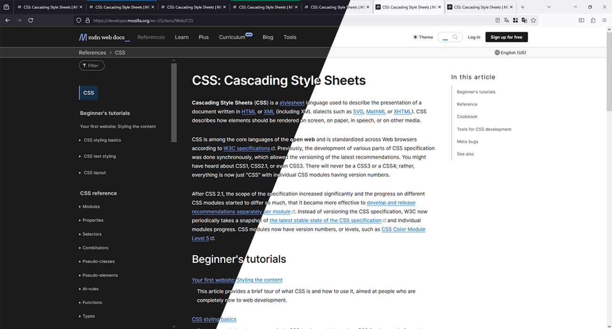

# ClearTabs for Firefox

ClearTabs is a Firefox user CSS customization that enhances the browser's tab interface. It improves the visual separation between tabs and the toolbar, adds a line between tabs for a clearer distinction, and supports Firefox Multi-Account Containers with better visual integration. Additionally, it applies a default favicon to websites that don't provide one, ensuring consistent tab icons.

This extension is designed to work with all Firefox themes, providing seamless integration across light and dark modes. It aims to make the browsing experience more organized and visually appealing.



## Features

- **Cleaner Tab Separation**: Adds a line between tabs for better visual distinction.
- **Firefox Multi-Account Container Support**: Improves the look of Multi-Account Containers with color-coded borders.
- **Favicon Support**: Websites without a favicon will display a default favicon.
- **Theme Support**: Works with all Firefox themes, adapting to light and dark modes.
- **Custom Tab Styling**: Customizes the appearance of active and inactive tabs.

## Installation

To install this customization, follow these steps:

### 1. Download the Files

1. Click on the green **Code** button and select **Download ZIP**.
2. Extract the ZIP file to a location of your choice.

### 2. Enable `user CSS` in Firefox

1. Open Firefox and type `about:config` in the address bar.
2. Search for `toolkit.legacyUserProfileCustomizations.stylesheets` and set it to `true`.
3. Restart Firefox.

### 3. Place the Files in Your Firefox Profile

1. Navigate to your Firefox profile folder. You can find it by going to `about:support` in Firefox and clicking on "Open Folder" next to "Profile Directory."
2. Extract the **chrome** folder from the ZIP file directly into your Firefox profile folder.
3. The folder structure should look like this:

```
profile-folder/
└── chrome/
    ├── userChrome.css
    └── icons/
        └── favicon.svg
```

### 4. Restart Firefox

After following the above steps, restart Firefox to apply the changes.

## Author

Created by **[TheSytx](https://github.com/TheSytx)**
